# End-to-End Data Flow & Sequence Architecture

**Canonical Specification of Telemetry Processing & RAG Resolution Lifecycles**

---

## 1. Primary Lifecycle: Telemetry Ingestion to 4-Stage Runbook

```mermaid
sequenceDiagram
    autonumber
    actor NOC as NOC Operator / Syslog Agent
    participant Console as NOC Console UI (frontend)
    participant API as FastAPI Router (backend/routes)
    participant Parser as TelemetryParserService
    participant Vector as VectorService (Hybrid Search)
    participant DB as PostgreSQL (pgvector + GIN)
    participant AI as AIService (RAG Synthesizer)
    participant Ledger as Audit Ledger Table

    NOC->>Console: Select Incident Preset or Paste Raw Syslog
    Console->>API: POST /troubleshoot {device_id, vendor, raw_logs}
    
    rect rgb(20, 30, 50)
        Note over API,Parser: Stage 1: Telemetry Parsing & Tokenization
        API->>Parser: parse_log(raw_logs, device_hint)
        Parser-->>API: ParsedTelemetry (vendor, protocol, peer_ip, event_code, severity)
    end

    rect rgb(30, 45, 70)
        Note over API,Vector: Stage 2: Hybrid Knowledge Retrieval
        API->>Vector: find_relevant_docs(query, limit=3, vendor, protocol)
        Vector->>Vector: embed_text(query) -> 384-dim vector
        alt PostgreSQL Connected
            Vector->>DB: SQL Hybrid Query (Dense <=> $1 + Sparse ts_rank_cd)
            DB-->>Vector: Ranked Documentation Chunks
        else Offline / Disconnected
            Vector->>Vector: Score ENTERPRISE_FALLBACK_CORPUS (RRF)
        end
        Vector-->>API: List[VendorDocCitation]
    end

    rect rgb(40, 60, 90)
        Note over API,AI: Stage 3: Playbook Synthesis & Risk Scoring
        API->>AI: suggest_resolution_from_docs(request)
        alt LLM API Key Present (OpenAI/Azure)
            AI->>AI: Call AsyncOpenAI(system_prompt, vendor_context, raw_log)
        else Deterministic Engine
            AI->>AI: Synthesize 4-stage playbook (Pre, Fix, Post, Rollback)
        end
        AI->>Ledger: INSERT INTO troubleshooting_audit_ledger
        AI-->>API: TroubleshootResponse (Diagnosis, 4 Stages, Citations)
    end

    API-->>Console: 200 OK (JSON Payload)
    Console->>Console: renderResults() -> Update Canvas & Operational Timeline
    Console-->>NOC: Display Executive Verdict & Structured CLI Commands
```



---

## 2. Batch Telemetry Ingestion Flow (`/telemetry/ingest`)

When external carrier syslog aggregators (e.g. Syslog-ng, Fluentd, Kafka) stream logs to the API:

```
[ BATCH SYSLOG STREAM: List[str] ]
                 │
                 ▼
     [ POST /telemetry/ingest ]
                 │
                 ▼
 ┌───────────────────────────────┐
 │   For each log in batch:      │
 │   1. Tokenize via parser      │
 │   2. Check severity level     │
 └───────────────┬───────────────┘
                 │
      ┌──────────┴──────────┐
      │ Is CRITICAL/ERROR   │
      │ & auto_troubleshoot?│
      └──────────┬──────────┘
                 │
        ┌────────┴────────┐
        │ YES             │ NO
        ▼                 ▼
 ┌──────────────┐   ┌──────────────┐
 │ Execute RAG  │   │ Return       │
 │ Diagnostics  │   │ Normalized   │
 │ & Runbook    │   │ Event Only   │
 └──────┬───────┘   └──────┬───────┘
        │                  │
        └─────────┬────────┘
                  │
                  ▼
 [ TelemetryIngestResponse JSON: total_received, parsed_events, troubleshooting_reports ]
```

---

## 3. Knowledge Base ETL Ingestion Flow (`scripts/ingest_vendor_docs.py`)

When indexing new official vendor manuals into the PostgreSQL pgvector database:

```
[ OFFICIAL VENDOR TAC REPOSITORIES / HTML MANUALS ]
                        │
                        ▼
         [ Web Scraper / Fallback Text Loader ]
                        │
                        ▼
      [ Text Chunker (400 Words, 50 Word Overlap) ]
                        │
                        ▼
 [ Dense Vector Embedding Generator (all-MiniLM-L6-v2) ]
                        │
                        ▼
   [ PostgreSQL pgvector Knowledge Store (HNSW + GIN) ]
   • Table: vendor_knowledge
   • Vector: 384-dimensional cosine embeddings
   • TSVector: English dictionary tokenization
```
