# End-to-End Data Flow & Sequence Architecture

**Canonical Specification of Telemetry Processing, Streaming Pipelines & RAG Lifecycles**

---

## 1. Primary Synchronous Lifecycle: Telemetry Diagnostic to 4-Stage Runbook

This flow represents an engineer diagnosing an incident from raw syslog strings via the modern Next.js UI or legacy console:

```mermaid
sequenceDiagram
    autonumber
    actor NOC as NOC Engineer / Operator
    participant UI as Next.js 14 Frontend / Legacy Console
    participant API as FastAPI Router (backend/presentation/api)
    participant UseCase as SynthesizeRemediationRunbookUseCase
    participant Parser as TelemetryParserAdapter
    participant Embed as Decoupled Embedding Worker (:8001)
    participant Vector as VectorRepository (Qdrant / pgvector)
    participant AI as AISynthesizer (Deterministic / LLM)
    participant Ledger as AuditRepository (PostgreSQL)

    NOC->>UI: Select Preset or Input Raw Syslog & Device ID
    UI->>API: POST /troubleshoot {device_id, vendor, raw_logs}
    API->>UseCase: execute(command: TroubleshootRequestDTO)
    
    rect rgb(20, 35, 55)
        Note over UseCase,Parser: Stage 1: Telemetry Parsing & Tokenization
        UseCase->>Parser: parse(raw_logs, device_id)
        Parser-->>UseCase: ParsedTelemetry (vendor, protocol, peer_ip, event_code, severity)
    end

    rect rgb(30, 50, 75)
        Note over UseCase,Vector: Stage 2: Hybrid Knowledge Retrieval
        UseCase->>Embed: POST /embed [query]
        alt Embedding Worker Online
            Embed-->>UseCase: 384-dim normalized dense vector
        else Embedding Worker Offline
            UseCase->>UseCase: Local fallback / SHA-256 normalized vector
        end
        UseCase->>Vector: search_hybrid(dense_vector, text_query, vendor, protocol, limit=5)
        alt Database Cluster Connected
            Vector-->>UseCase: Ranked VendorDocCitation[] (RRF: 65% Dense + 35% Sparse)
        else Offline / Disconnected
            Vector->>Vector: Score ENTERPRISE_FALLBACK_CORPUS (In-Memory RRF)
            Vector-->>UseCase: Ranked Fallback Citations[]
        end
    end

    rect rgb(40, 65, 95)
        Note over UseCase,AI: Stage 3: Playbook Synthesis & Risk Scoring
        UseCase->>AI: synthesize(parsed_telemetry, citations)
        alt OPENAI_API_KEY Present
            AI->>AI: Call AsyncOpenAI(system_prompt, vendor_context, raw_log)
        else Deterministic Engine
            AI->>AI: Synthesize 4-stage playbook (Pre-Checks, CLI Fix, Post-Checks, Rollback)
        end
        AI-->>UseCase: RemediationPlaybook & RiskAssessment
    end

    rect rgb(25, 45, 65)
        Note over UseCase,Ledger: Stage 4: Immutable Audit Preservation
        UseCase->>Ledger: record(audit_entry: AuditRecord)
        Ledger-->>UseCase: Recorded confirmation
    end

    UseCase-->>API: TroubleshootResponseDTO
    API-->>UI: 200 OK (JSON Payload)
    UI-->>NOC: Render Risk Banner, 4-Stage Commands & Citations
```



---

## 2. Asynchronous CQRS Streaming Data Flow

This flow represents high-velocity production telemetry ingestion from carrier routers through the streaming data plane:

```
[ CARRIER ROUTERS: Cisco, Juniper, Arista, VeloCloud ]
                         │
                         ▼ Syslog UDP/TCP Port 514
┌────────────────────────────────────────────────────────┐
│               Vector Ingestion DaemonSet               │
│   • Buffers incoming raw UDP/TCP syslog packets        │
│   • Enriches with ingest timestamp and host metadata   │
│   • Ships to Redpanda broker                           │
└────────────────────────┬───────────────────────────────┘
                         │
                         ▼ Kafka Protocol (Port 9092)
┌────────────────────────────────────────────────────────┐
│               Redpanda Streaming Broker                │
│   • Topic: vat.telemetry.raw (Partitioned, 3 Replicas) │
└──────────────┬───────────────────────────┬─────────────┘
               │                           │
               ▼ Kafka Engine              ▼ aiokafka Consumer
┌──────────────────────────────┐ ┌──────────────────────────────┐
│       ClickHouse 24.3        │ │  Telemetry Processing Worker │
│  • Table: vat.telemetry_raw  │ │  • Consumes raw syslog stream│
│  • Columnar analytical store │ │  • Tokenizes via Regex Parser│
│  • Sub-second query latency  │ │  • Evaluates severity & flags│
└──────────────────────────────┘ └──────────────┬───────────────┘
                                                │
                                                ▼ Publishes parsed events
                                 ┌──────────────────────────────┐
                                 │  Topic: vat.telemetry.parsed │
                                 └──────────────┬───────────────┘
                                                │
                 ┌──────────────────────────────┴──────────────────────────────┐
                 ▼                                                             ▼
┌──────────────────────────────┐                              ┌──────────────────────────────┐
│       ClickHouse 24.3        │                              │     FastAPI WebSocket Hub    │
│  • Table: vat.telemetry_parsed│                             │     Endpoint: /ws/telemetry  │
│  • ReplacingMergeTree engine │                              │  • Broadcasts live events    │
│  • Filtered by severity,     │                              │  • Subscribed by frontend    │
│    vendor, and event codes   │                              └──────────────┬───────────────┘
└──────────────────────────────┘                                             │
                                                                             ▼
                                                              ┌──────────────────────────────┐
                                                              │   Modern Next.js 14 NOC UI   │
                                                              │  • TelemetryStream component │
                                                              │  • Live event auto-scroll    │
                                                              │  • 1-Click diagnostic trigger│
                                                              └──────────────────────────────┘
```

---

## 3. Batch Telemetry Ingestion Flow (`POST /telemetry/ingest`)

When external carrier collectors (e.g. Syslog-ng, Fluentd, HTTP webhooks) submit batched telemetry arrays via REST:

```
[ BATCH SYSLOG PAYLOAD: List[str] ]
                 │
                 ▼
     [ POST /telemetry/ingest ]
                 │
                 ▼
 ┌───────────────────────────────────────────┐
 │ IngestTelemetryBatchUseCase Orchestration │
 │ For each log entry in batch:              │
 │ 1. Tokenize via TelemetryParserAdapter    │
 │ 2. Extract vendor, protocol, severity     │
 └─────────────────────┬─────────────────────┘
                       │
          ┌────────────┴────────────┐
          │ Is CRITICAL / ERROR     │
          │ & auto_troubleshoot?    │
          └────────────┬────────────┘
                       │
            ┌──────────┴──────────┐
            │ YES                 │ NO
            ▼                     ▼
 ┌──────────────────────┐   ┌──────────────────────┐
 │ Execute Hybrid RAG   │   │ Add Parsed Event to  │
 │ Diagnostic Runbook   │   │ Summary List Only    │
 └──────────┬───────────┘   └──────────┬───────────┘
            │                          │
            └────────────┬─────────────┘
                         │
                         ▼
 [ TelemetryIngestResponseDTO: total_received, parsed_events, troubleshooting_reports ]
```

---

## 4. Real-Time WebSockets Synthesis Flow (`/ws/troubleshoot`)

To provide immediate user feedback during complex multi-stage RAG operations:

1. **Client Connection**: Client initiates WebSocket handshake at `/ws/troubleshoot`.
2. **Heartbeat & Auth**: Server accepts and registers client connection in active connection pool.
3. **Progress Stages Broadcast**:
   - `{"stage": "PARSING", "progress": 25, "message": "Tokenizing syslog string..."}`
   - `{"stage": "RETRIEVAL", "progress": 50, "message": "Executing hybrid dense-sparse vector search..."}`
   - `{"stage": "SYNTHESIS", "progress": 75, "message": "Synthesizing 4-stage remediation runbook..."}`
   - `{"stage": "COMPLETE", "progress": 100, "data": <Full TroubleshootResponseDTO>}`
4. **Error Handling**: On failure, emits `{"stage": "ERROR", "error": "<Message>"}` and gracefully falls back to deterministic rule synthesis.

---

## 5. Data Provenance & Real Data Origins

| Data Element | Actual Origin in Codebase |
| :--- | :--- |
| **Raw Syslog Strings** | Ingested via UDP/TCP 514 (Vector), REST payloads (`/telemetry/*`), or operator input in the UI. |
| **Parsed Metadata** | Deterministically extracted by `TelemetryParserAdapter` regex tokenizers matching vendor syslog grammars. |
| **Vendor Document Chunks** | Official vendor TAC manuals indexed in PostgreSQL `vendor_knowledge` / Qdrant, or embedded in `ENTERPRISE_FALLBACK_CORPUS`. |
| **Dense Embeddings** | Generated via `SentenceTransformer("all-MiniLM-L6-v2")` running in `services/embedding_service` or local in-process fallback. |
| **Remediation CLI Commands** | Synthesized deterministically from verified vendor manual action templates or synthesized via LLM guided by vendor citations. |
| **Audit Ledger Records** | Persisted immutably into PostgreSQL `troubleshooting_audit_ledger` with timestamps and JSONB steps. |
